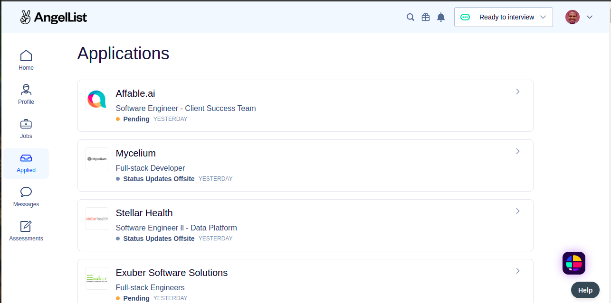
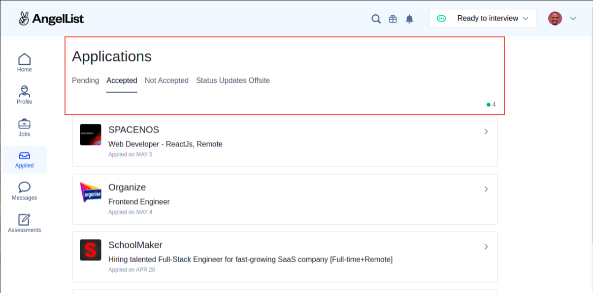

# AngelList Feature Recommendation.

> Feature Recommendation to intuitively categorize applications on AngelList

Angel.co

My Recommendation

The Feature Recommendation categorizes jobs with the same status under a single tab and displays a jobs counter with default AngelList status color.

## Built With

- JavaScript
- HTML and CSS
- Bootstrap

## Live Demo

Click [here](https://francisuloko.github.io/angellist-feature) to preview Live App.

## Getting Started

To get a local copy up and running follow these simple example steps.

### Prerequisites

 - Internet and Broswer

### Setup

  - run `git clone https://francisuloko.github.io/angellist-feature.git` to clone the project.

### Usage
- Open angellist-feature directory
- Open index.html in the browswer

## Authors

👤 **Francis Uloko**
- [GitHub](https://github.com/francisuloko).
- [Twitter](https://twitter.com/francisuloko).
- [LinkedIn](https://linkedin.com/in/francisuloko).

## 🤝 Contributing

Contributions, issues, and feature requests are welcome!

Feel free to check the [issues page](https://francisuloko.github.io/angellist-feature/issues).

## Show your support

Give a ⭐️ if you like this project!

## Acknowledgments

[AngelList](angel.co)

## 📝 License

This project is [MIT](./MIT.md) licensed.